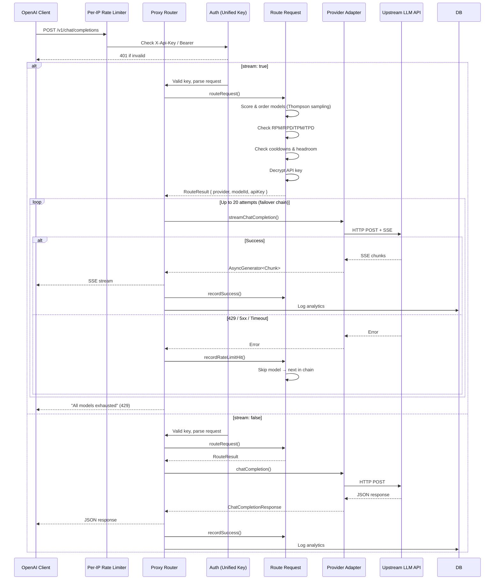
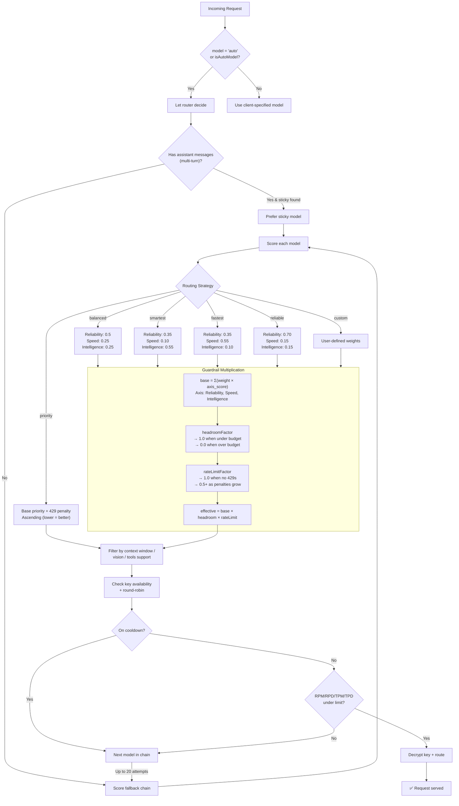
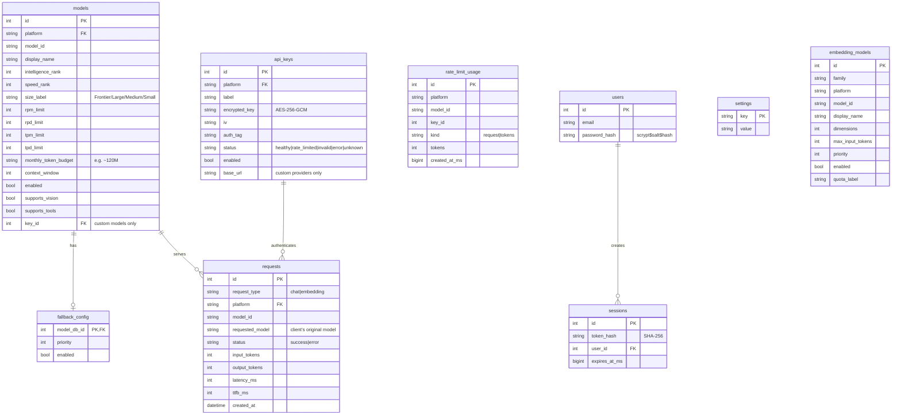
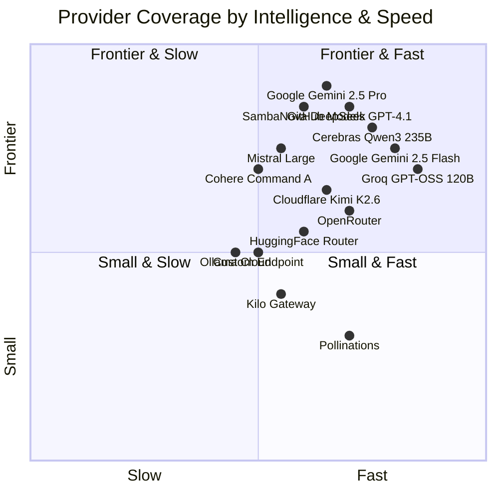

# FreeLLMAPI — Architecture Diagram

```mermaid
---
title: FreeLLMAPI System Architecture
---
graph TB
    %% ── External Clients ──────────────────────────────────────────
    subgraph Clients["Clients"]
        C1["OpenAI SDK / LangChain / LlamaIndex"]
        C2["Codex CLI / Claude Code / Agents"]
        C3["Custom HTTP Clients"]
    end

    %% ── Client-Side App ──────────────────────────────────────────
    subgraph Dashboard["Admin Dashboard (React + Vite)"]
        direction TB
        D1["App.tsx<br/>Routing & Auth Gate"]
        D2["Pages: KeysPage, PlaygroundPage,<br/>FallbackPage, EmbeddingsPage,<br/>AnalyticsPage"]
        D3["Components:<br/>auth-gate, floating-bar,<br/>markdown, models-tabs,<br/>page-header, ui/*"]
        D4["lib/api.ts<br/>API Fetch Layer"]
    end

    %% ── Server ───────────────────────────────────────────────────
    subgraph Server["Express Server (Node.js 20+)"]
        direction TB

        subgraph Middleware["Middleware Stack"]
            M1["helmet + cors<br/>(CSP disabled)"]
            M2["express.json<br/>(10mb limit)"]
            M3["createProxyRateLimiter()<br/>Per-IP, 120 RPM default"]
            M4["requireAuth<br/>(Session token gate)"]
            M5["errorHandler"]
        end

        subgraph Routes["API Routes"]
            R_AUTH["/api/auth<br/>Status, Setup, Login, Logout"]
            R_KEYS["/api/keys<br/>CRUD + encrypt/decrypt"]
            R_MODELS["/api/models<br/>List + availability"]
            R_FALLBACK["/api/fallback<br/>Chain order + routing strategy"]
            R_EMB["/api/embeddings<br/>Family config + usage"]
            R_ANALYTICS["/api/analytics<br/>Summary + by-model + savings"]
            R_HEALTH["/api/health<br/>Key health checks"]
            R_SETTINGS["/api/settings<br/>Unified API key mgmt"]
            R_PING["/api/ping"]
        end

        subgraph ProxyRoutes["OpenAI-Compatible Proxy"]
            P_CHAT["POST /v1/chat/completions<br/>(Streaming + Non-streaming)"]
            P_RESP["POST /v1/responses<br/>(Responses API shim for Codex)"]
            P_MODELS["GET /v1/models"]
            P_EMB["POST /v1/embeddings"]
        end
    end

    %% ── Services ─────────────────────────────────────────────────
    subgraph Services["Core Services"]
        S_ROUTER["router.ts<br/>Route request → best model"]
        S_SCORING["scoring.ts<br/>Thompson-sampled bandit:<br/>Reliability + Speed + Intelligence<br/>× Headroom × RateLimit"]
        S_RATELIMIT["ratelimit.ts<br/>Sliding window counters<br/>RPM/RPD/TPM/TPD"]
        S_AUTH["auth.ts<br/>scrypt passwords<br/>Session tokens (30d TTL)"]
        S_HEALTH["health.ts<br/>Periodic key validation<br/>Auto-disable @ 3 failures"]
        S_EMBED["embeddings.ts<br/>Family-based routing<br/>Cross-provider redundancy"]
        S_RETENTION["request-retention.ts<br/>90-day analytics retention<br/>Auto-prune @ 100K rows"]
    end

    %% ── Providers ────────────────────────────────────────────────
    subgraph Providers["Provider Adapters"]
        direction TB
        PROV_BASE["BaseProvider<br/>(abstract)"]
        PROV_OPENAI["OpenAICompatProvider<br/>Groq, Cerebras, SambaNova,<br/>NVIDIA, Mistral, OpenRouter,<br/>GitHub, Zhipu, HuggingFace,<br/>Ollama, Kilo, Pollinations,<br/>LLM7, OpenCode, Custom"]
        PROV_GOOGLE["GoogleProvider<br/>(Gemini native API)"]
        PROV_COHERE["CohereProvider<br/>(compat endpoint)"]
        PROV_CF["CloudflareProvider<br/>(account_id:token format)"]
    end

    %% ── Database ─────────────────────────────────────────────────
    subgraph Database["SQLite (better-sqlite3)"]
        DB_MAIN["freeapi.db<br/>WAL mode"]
        DB_MODELS["models + fallback_config +<br/>embedding_models"]
        DB_KEYS["api_keys<br/>(AES-256-GCM encrypted)"]
        DB_USAGE["rate_limit_usage<br/>requests + tokens sliding window"]
        DB_REQUESTS["requests<br/>(analytics log)"]
        DB_USERS["users + sessions"]
        DB_SETTINGS["settings KV store"]
    end

    %% ── Desktop App ──────────────────────────────────────────────
    subgraph Desktop["Electron Desktop App"]
        DT_MAIN["main.ts<br/>BrowserWindow"]
        DT_TRAY["tray.ts<br/>System tray"]
        DT_SERVER["server-host.ts<br/>Embedded server host"]
        DT_POPOVER["popover.ts<br/>Quick-access popover"]
    end

    %% ── Shared Types ─────────────────────────────────────────────
    subgraph Shared["@freellmapi/shared"]
        ST["types.ts<br/>Platform, ChatMessage,<br/>ChatCompletionResponse,<br/>Model, ApiKey, etc."]
    end

    %% ── Libraries ────────────────────────────────────────────────
    subgraph Libraries["Server Libraries"]
        L_CRYPTO["crypto.ts<br/>AES-256-GCM encrypt/decrypt"]
        L_CONTENT["content.ts<br/>Message normalization"]
        L_BUDGET["budget.ts<br/>Free-tier budget parser"]
        L_TOOLARGS["tool-args.ts<br/>Double-encoded JSON repair"]
        L_TOOLCALL["tool-call-rescue.ts<br/>Inline dialect detection"]
        L_ERROR["error-redaction.ts<br/>Key/token sanitization"]
        L_PASSWORD["password.ts<br/>scrypt hashing"]
        L_ESTIMATE["request-estimate.ts<br/>Token estimation heuristic"]
    end

    %% ── Connections ──────────────────────────────────────────────
    Clients -->|HTTP / SSE| Middleware
    Middleware --> Routes
    Middleware --> ProxyRoutes

    ProxyRoutes --> S_ROUTER
    ProxyRoutes --> S_EMBED

    S_ROUTER --> S_SCORING
    S_ROUTER --> S_RATELIMIT
    S_ROUTER --> Providers

    Providers --> PROV_OPENAI
    Providers --> PROV_GOOGLE
    Providers --> PROV_COHERE
    Providers --> PROV_CF

    Routes --> S_AUTH
    Routes --> S_HEALTH
    Routes --> S_RETENTION

    S_ROUTER --> DB_MAIN
    S_RATELIMIT --> DB_MAIN
    S_AUTH --> DB_MAIN
    S_HEALTH --> DB_MAIN
    S_RETENTION --> DB_MAIN

    L_CRYPTO --> DB_KEYS
    L_TOOLARGS --> ProxyRoutes
    L_TOOLCALL --> ProxyRoutes
    L_CONTENT --> Providers
    L_ESTIMATE --> ProxyRoutes

    Dashboard -->|fetch /api/*| Routes
    Dashboard -->|fetch /v1/*| ProxyRoutes

    Desktop --> Server
    Shared --> Server
    Shared --> Dashboard
```

## Request Flow (Chat Completion)

## Routing Strategy Decision Tree

## Database Schema (Simplified)

## Provider Matrix

## Key Design Decisions

| Decision | Rationale |
|---|---|
| **SQLite over PostgreSQL** | Single-user tool; zero external deps; WAL mode for concurrent reads |
| **AES-256-GCM key encryption** | Keys decrypted only in-memory just before use; IV + auth tag stored per row |
| **Bandit routing over fixed chain** | Thompson sampling explores automatically; proportional to uncertainty |
| **Exponential decay weighting** | Recent behavior dominates; old data still stabilizes estimates |
| **Sticky sessions (30min TTL)** | Prevents hallucination from mid-conversation model switches |
| **In-memory rate limit penalty** | Fast-path for 429 backoff; decays every 2 minutes |
| **Responses API shim** | Codex CLI requires `wire_api="responses"`; translates to chat completions |
| **Tool-call dialect rescue** | Detects Kimi/DeepSeek/Llama/Qwen inline tool syntax mid-stream |
| **Per-IP rate limiter (120 RPM)** | Blunts brute-force attacks on the unified API key |
| **scrypt password hashing** | Built into Node.js; no external bcrypt/argon2 dependency |
